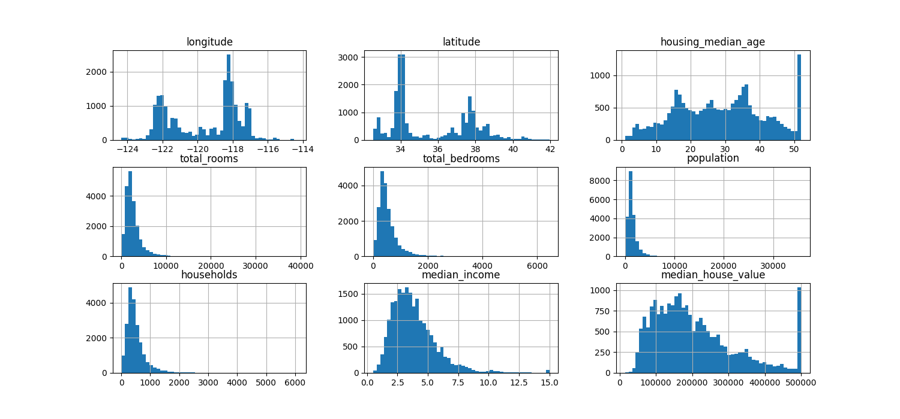
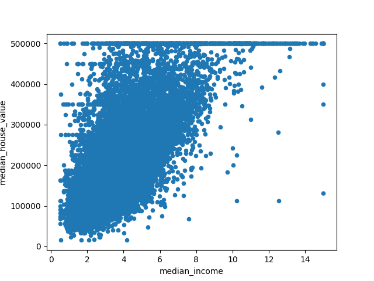

# California District Housing Price 

## Objective

Train and deploy a machine learning model, and serve it for online consumption.

Data source: The 1990 US census district housing prices of California, available on Kaggle: https://www.kaggle.com/datasets/camnugent/california-housing-prices/data

## Result

- train_model.py: this is the file that trains the ML model. It loads the data from housing.csv, splits the data into train and test data, processes the data through a pipeline, trains the ML model, and finally evaluates the model. The final model is a file titled: rfr_{current_datetime}.pkl.
    - Model choice: Random Forest Regressor
    - Evaluation:
        - Evaluation metric: Root Mean Square Error (RMSE). On the final evaluation on the test set (20% of data) the RMSE is: 49859.0455877848
        - Mean RMSE with 10-fold cross-validation: 50713.8836593512
        - RMSE on the training set: 18648.4618466542
        - The model is overfitting the training data.
- The live API endpoint (deployed on GCP): https://california-housing-prices-prediction-f4i2jppbwa-ew.a.run.app/predict
    - You can find the API docs here: https://california-housing-prices-prediction-f4i2jppbwa-ew.a.run.app/redoc
    - example_api_query.py contains example data and performs a post request to the API endpoint
    - Dockerfile is used to create a container which is deployed to Google Cloud Run

## Description

### Specifications

Python version: 3.10.0
pip version: 21.2.3

### Data Exploration

- The data is stored in housing.csv. It is a 1.4 MB CSV file containing 20640 rows of data and 10 columns. This easily fits into memory. No need to use a database.

- The data contains 9 features and 1 target variable (median_house_value). The features are:
    - longitude
    - latitude
    - housing_median_age
    - total_rooms
    - total_bedrooms
    - population
    - households
    - median_income
    - ocean_proximity

Data set oberservations (run explore/data_exploration.py to verify):
- df.info(): that there are 207 missing values in the total_bedrooms column.
- All values are numerical, except "ocean_proximity", which is text. It is a categorical variable with 5 possible values.
- Plot the histograms of all numerical values:

- The housing_median_age is capped at 50.
- The median_income is not expressed in USD. It is scaled and capped at 15 ($150,000).
- The median_house_value is capped at 500,000 USD. Verify the specific use case to see if this is a problem.
- The attributes have very different scales. None of them have a Gaussian distribution.

### Train/Test Split

The data is split into train and test data. The test data is 20% of the total data.

### Data Insights

A visualization of the Geographical data:

The correlation matrix shows that the median_income is the only attribute that has a significant linear correlation with the median_house_value.

Here is a scatter plot of the median_income vs the median_house_value:

### Data Preprocessing

- Combining data:
    - rooms_per_household: total_rooms / households
    - bedrooms_per_household: total_bedrooms / households
    - population_per_household: population / households
- Impute missing values: add the median value for missing values
- Feature scaling: use standardization to put the numerical values at the same scale (subtract the mean and divide by standard deviation).
- One-hot encoding of categorical variable: ocean_proximity

### Model Selection

- This is a supervised learning problem. We have the expected output (median_house_value) for each data point.
- This is a regression problem. We want to predict a continuous value (median_house_value). We have multiple features to make the prediction.
- The Root Mean Square Error (RMSE) is the typical performance metric of a regression task.
- Criteria for model selection:
    - We have a lot of features available (9). There are no linear correlations in most of our features and the price. So a model that's too simple (e.g. Linear Regression) will likely underfit the data.
    - We have a relatively small data set (20,640). So we need to be careful not to overfit the data either.
- A Random Forest Regressor can discover non-linear correlations in the data. Its hyperparameters can also be tuned to constrain the model to limit overfitting. It is also an ensemble model, which usually performs better than a single model. So it is a good candidate for this problem.

### Next Steps

- Test out multiple models: Gradient Boost Regression, cluster model on geographical data, Neural Network Regressor, Linear Regression on median_income, ...
- Fine-tune the model hyperparameters using Grid Search and Randomized Search
- Analyze the most significant variables for each algorithm.
- Experiment with combining models into an ensemble.
- Use stratified sampling to ensure that the test set is representative of the overall data set.