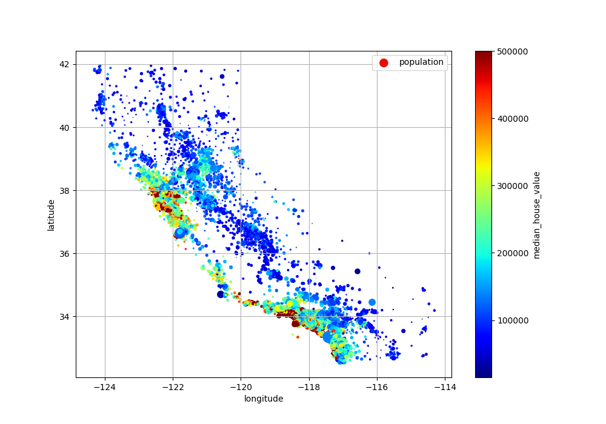

# California Discrict Housing Price 

## Objective

Train and deploy a machine learning model, and serve it for online consumption.

Data source: The 1990 US census district housing prices of California, available on Kaggle: https://www.kaggle.com/datasets/camnugent/california-housing-prices/data

## Result

- train_model.py: this is the file that trains the ML model. It loads the data from housing.csv, splits the data in train and test data, pricesses the data through a pipeline, trains the ML model, and finally evaluates the model. The final model is stored in file titled: rfr_{current_datetime}.pkl.
    - Model choice: Random Forest Regressor
    - Evaluation metric: Root Mean Square Error (RMSE). On the final evaluation on the test set (20% of data) the RMSE is: 49859.0455877848
- The live API endpoint (deployed on GCP): https://california-housing-prices-prediction-f4i2jppbwa-ew.a.run.app/predict
    - You can find the API docs here: https://california-housing-prices-prediction-f4i2jppbwa-ew.a.run.app/redoc
    - example_api_query.py contains example data and performs a post request to the API endpoint
    - Dockerfile is used to create a container which is deployed to Google Cloud Run

 
